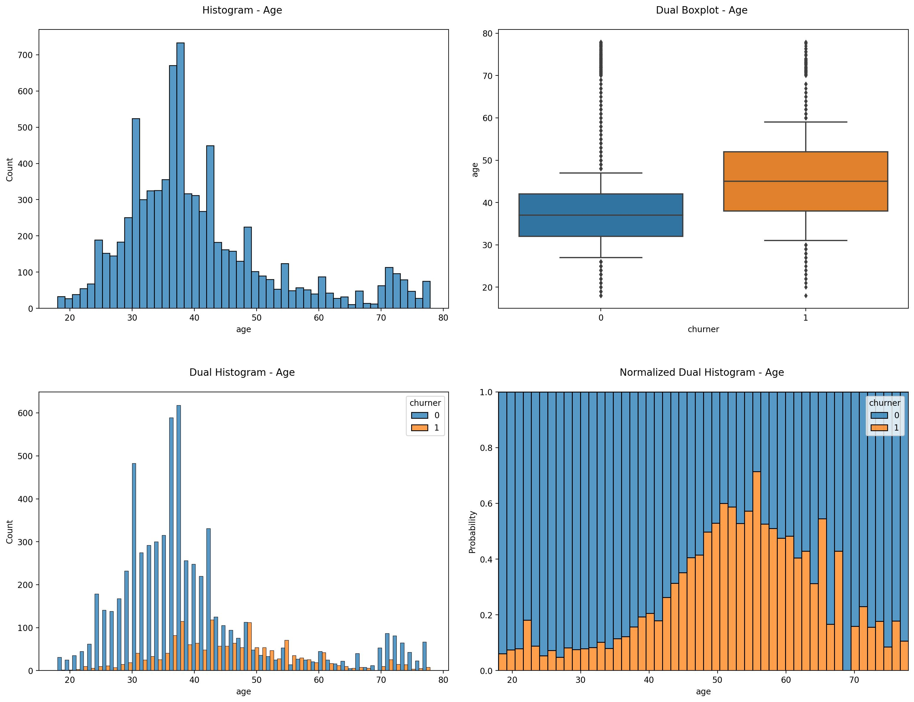
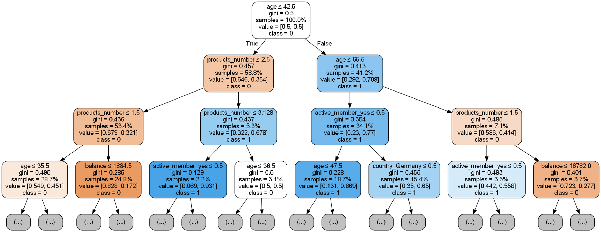
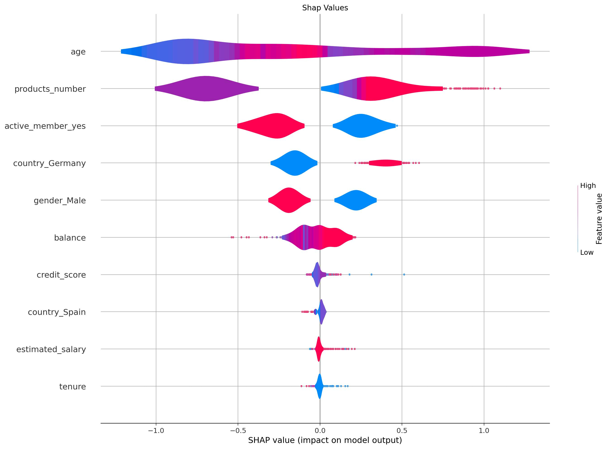
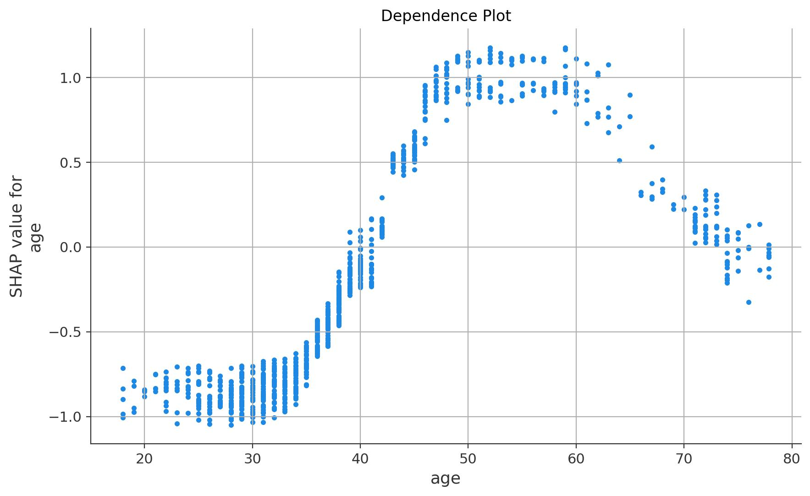
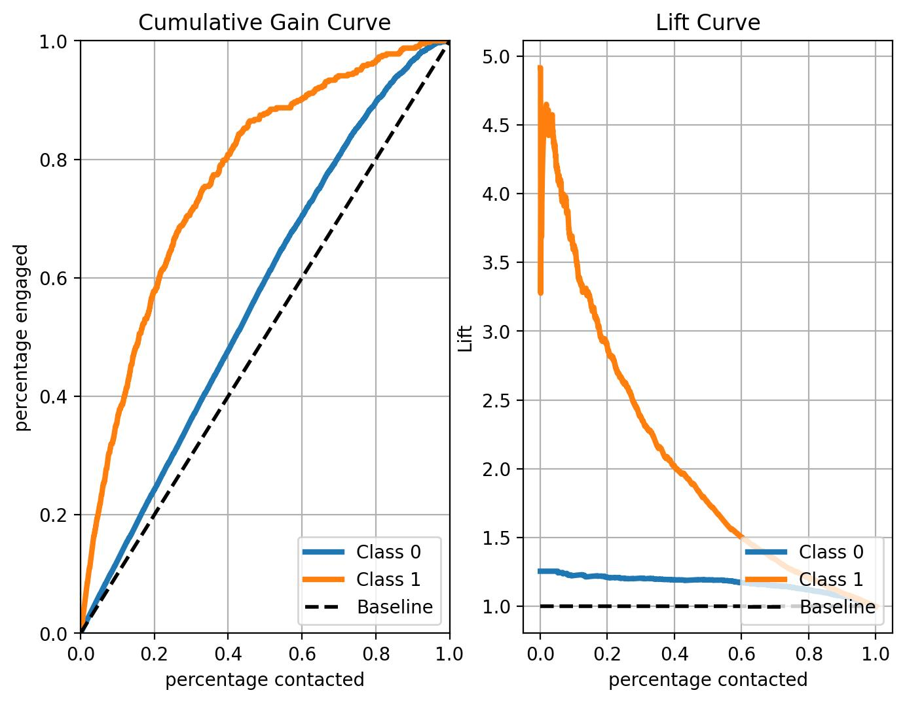

# Customer Churn Prediction Model: Implementation of an End-to-End Machine Learning Solution 

 

## **Outline:**  
- [Motivation](#motivation)
- [Data Source](#data-source)
- [Project Goal](#project-goal)
- [Solution Approach](#solution-approach)
- [Tools](#tools)
- [Solution Steps](#solution-steps)
- [Key Findings - Average Engagement Rate](#key-findings---average-engagement-rate)
- [Key Findings - Drivers to Marketing Engagement](#key-findings---drivers-to-marketing-engagement)
- [Key Findings - Engagement Prediction Model Evaluation](#key-findings---engagement-prediction-model-evaluation)
- [Model Deployment](#model-deployment)

 

## **Motivation:**  
The advantages of predicting churners in an industry setting through machine learning are immense. Machine learning offers a unique opportunity to uncover patterns and insights from large datasets that would be impossible to detect with manual analysis. By leveraging predictive modeling, businesses can accurately predict customer churn and make informed decisions that help them retain customers and increase customer loyalty. Predictive models allow businesses to tailor their marketing campaigns to target customers who are most likely to stay and offer incentives to customers who are likely to leave. By doing so, businesses can proactively reduce churn and maximize customer retention. Additionally, predictive models can help businesses better understand customer behavior and preferences, allowing them to develop more effective products and services to meet their customers’ needs. With machine learning, businesses have the power to identify and address customer churn before it becomes a serious issue. 

 

## **Data Source:**  
This demo project is based on the publicly available dataset from Kaggle:  
https://www.kaggle.com/datasets/mathchi/churn-for-bank-customers

 

## **Project Goal:**  
The goal of this project is to  
1. identify the key drivers to churn, 
2. evaluate the churn prediction model,
3. implement web app using streamlit
3. transform web app into highly efficient software using Docker
4. deployed model in streamlit cloud: [streamlit cloud](https://sebastian1981-marketing-sales-customer-churn-web-appmain-sps62o.streamlit.app/)
 
 

## **Solution Approach:**  
The project is developed according to the well-known CRISP-DM
[CRISP-DM Model](https://en.wikipedia.org/wiki/Cross-industry_standard_process_for_data_mining).

- "Business Understanding", "Data Understanding", "Data Preparation", "Modeling" & "Evaluation": see Jupyter Notebook "/experiment/01_bank_customer_conversion_prediction_poc.ipynb". 
- "Deployment": see Jupyter Notebook "/experiment/02_bank_customer_conversion_prediction_scoring_pipeline.ipynb" and "/web_app". 

 

## **Tools:**  
vscode, python, jupyter, pandas, numpy, sklearn, shap, docker, streamlit

 

## **Solution Steps:**
1. undestanding and exploring the historical dataset of marketing campaigns using different data visualisation techniques using jupyter notebook
2. preparing the data for statistical modeling using jupyter notebook
3. training and tuning the best machine learning model using jupyter notebook
4. extract the diving features of marketing conversion exploiting novel methods of explainable artificial intelligence using jupyter notebook
5. implementing a web app to predict individual conversion probabilities using streamlit 
6. deployment of the web app using docker and streamlit cloud 

 

## **Key Findings - Average Engagement Rate:**

The average engagement rate among all customers is 12%. Hence, not leveraging the power of AI to focus targeting only the customers with the highest conversion rate is very ineffective.

 

## **Key Findings - Drivers to Marketing Engagement:**

<strong>Distribution Plots for Age</strong>

Apparently there is a clear age effect on the engagement rate. The age groups around 20 years and between 60-70 years are more likely to engage than the mid-agers.

<strong>Distribution Plots for Month</strong>

<strong>Pie-Plots of the monthly-distributions for the Non-Converters (left) and the Converters (right).</strong>

There is a clear seasonal effect on engagement rate. E.g. in the non-converters group, the largest proportion of customers is found in the month of May whereas in the converters group the proportion of customers in May is clearly smaller. Therefore, the month of May seems to have an unfavorable effect on the success of a marketing campaign.

<strong>Decision Tree Analysis</strong>

<strong>Prescriptive Analytics using a Simple Decision Tree.</strong>

The simple decision tree analysis shows that features "p_outcome", "contact" and "age" are among the key engagement drivers. The "p_outcome" variable represents whether the last marketing campaign was successful with a particular customer or not. The "contact" and "age" variables represent the type of contact and the customer ́s age, respectively. If we take a closer look at the decision tree, we can see, for example, that the conversion rate is 91% if the last marketing campaign was successful (“p_outcome_successfull”) and the customer is in the younger age group (“age<17.5”). In comparison, the global conversion rate is only 12%. Hence, focusing on this young-age group would already lift the conversion rate by a factor of more than 7. The decision tree analysis remarkably shows the value this data-based analysis can add for optimizing marketing campaigns. However, we would like a more comprehensive insight into the key drivers and their effect on engagement rates. Therefore, we applied a state-of-the-art explainable artificial intelligence approach to gain complete insight to what drives marketing success.

<strong>Shap Bar Plot</strong>

<strong>Key marketing engagement drivers detected by applying high performance complex machine 
learning models in combination with state-of-the-art explainable artificial intelligence methods.</strong>

The bar-plot of the shap-values show that the top-5 key drivers to marketing engagement are the features “contact_telephone”, “month_may”, “default_unkknown”, “age” and “poutcome_success”. The x-axis shows the likelihood of conversion affected by each feature. E.g. the features “contact_telephone” and “age” affect the likelihood of conversion on average by approx. 28% and 11%, respectively.

<strong>Shap Violin Plot</strong>

<strong>Key drivers and their explicit effect on the likelihood on engagement for each customer.</strong>

The shap value violine plot yields a deeper insight into the key drivers to engagement and their explicit affects on the likelihood on the conversion rate. Thereby each datapoint represents one customer. The impressive feature of this state-of-the-art explainable artificial intelligence approach is that the engagement probabilities can simply be linearly added up. E.g. contacting the customers not via telephone leads to a conversion probability of around 18% on 
average (center of blue distribution). The conversion probability is further increased by around 15% if the customer are not contacted in the month of May. Focusing on the customers with a known credit-default history increases the probability of engagement by further 10% approx. Hence, targeting this group, we end up with a net engagement probability of approx. 43%, which is significantly higher than the global conversion rate of 12%. Note that based on that powerful state-of-the-art explainable artificial intelligence approach, you can simply estimate the effective engagement probability for any target group! 

<strong>Shape Dependence Plot for Age</strong>

<strong>Age Effect on Engagement Probability.</strong>

The figure above explicitly shows how the customers age relates to engagement probability.

 

## **Key Findings - Engagement Prediction Model Evaluation:**

<strong>Conusion Matrix on Test Data</strong>

The confusion matrix shows the model performance in the form of the confusion matrix of the test dataset (i.e. data the model has not seen during training). It shows that the recall and the precision of the ml-model are both around 40%. But what does the accuracy of the model translate into increasing the effectiveness of the marketing campaign based on the ml-model?

<strong>CAP and Lift Curve on Test Data</strong>

<strong>Cumulative gain curve (left) and lift curve (right).</strong>

The cumulative gain and the lift curves show that contacting only the top 20% of the customers with the highest conversion probabilities predicted by the model yields around 50% engagement. This corresponds to a lift of around 2.5 compared to randomly picking customers i.e. not using any predictive model.

 

## **Model Deployment**
Based on the marketing engagement prediction model a web app was developed and deployed on [Docker-Hub](https://hub.docker.com/r/63531981/conversion_prediction_app) and in the [Streamlit-Cloud](https://sebastian1981-marketing-sales-conversion-pre-web-appmain-y81hcx.streamlit.app/)

 

<strong>Screenshot of the Marketing Engagement Prediction App.</strong>
