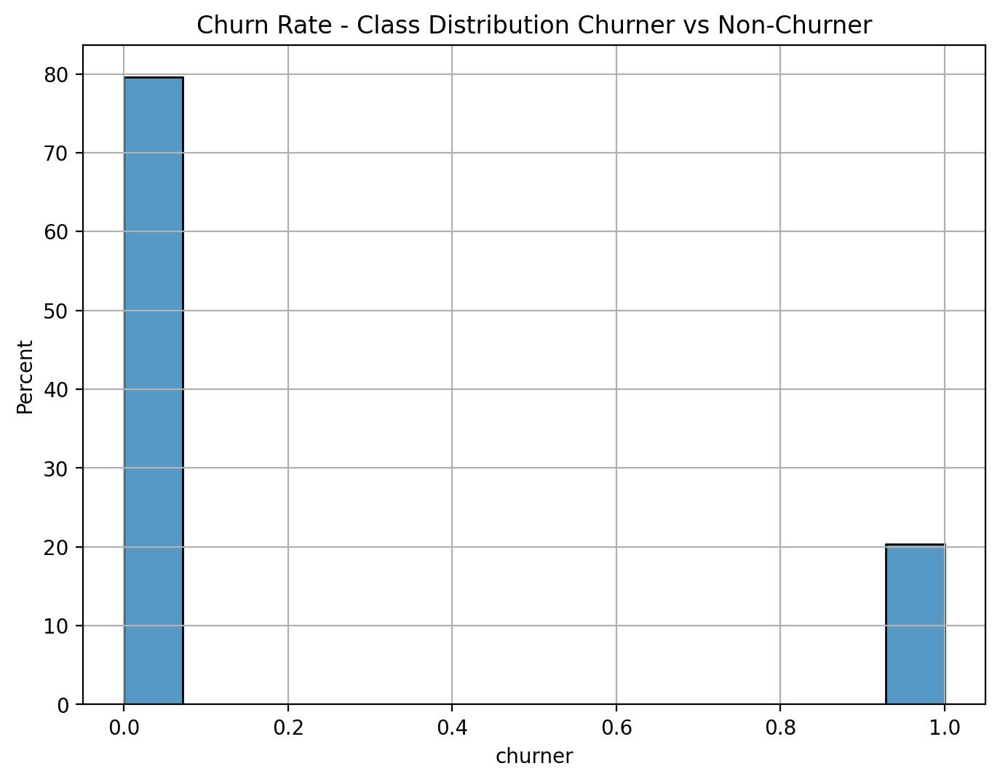
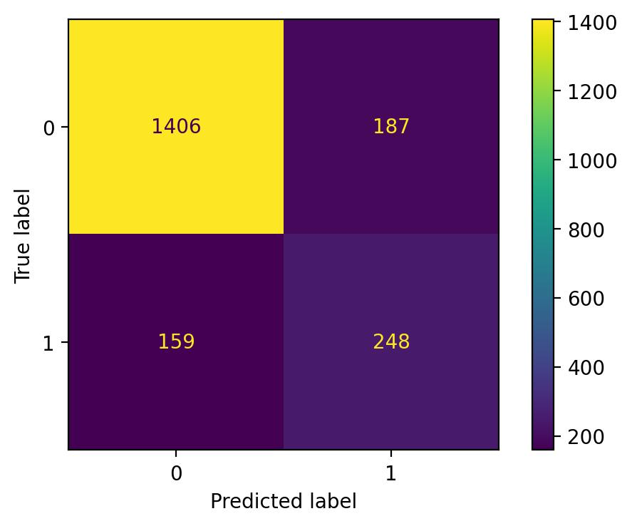

# Customer Churn Prediction Model: Implementation of an End-to-End Machine Learning Solution 

 

## **Outline:**  
- [Motivation](#motivation)
- [Data Source](#data-source)
- [Project Goal](#project-goal)
- [Solution Approach](#solution-approach)
- [Tools](#tools)
- [Solution Steps](#solution-steps)
- [Key Findings - Average Churn Rate](#key-findings---average-churn-rate)
- [Key Findings - Uncovering Churn Drivers](#key-findings---uncovering-churn-drivers)
- [Key Findings - Churn Prediction Model Evaluation](#key-findings---churn-prediction-model-evaluation)
- [Model Deployment](#model-deployment)

 

## **Motivation:**  
The advantages of predicting churners in an industry setting through machine learning are immense. Machine learning offers a unique opportunity to uncover patterns and insights from large datasets that would be impossible to detect with manual analysis. By leveraging predictive modeling, businesses can accurately predict customer churn and make informed decisions that help them retain customers and increase customer loyalty. Predictive models allow businesses to tailor their marketing campaigns to target customers who are most likely to stay and offer incentives to customers who are likely to leave. By doing so, businesses can proactively reduce churn and maximize customer retention. Additionally, predictive models can help businesses better understand customer behavior and preferences, allowing them to develop more effective products and services to meet their customers’ needs. With machine learning, businesses have the power to identify and address customer churn before it becomes a serious issue. 

 

## **Data Source:**  
This demo project is based on the publicly available dataset from Kaggle:  
https://www.kaggle.com/datasets/mathchi/churn-for-bank-customers

 

## **Project Goal:**  
The goal of this project is to  
1. identify the key drivers to churn, 
2. evaluate the churn prediction model,
3. implement web app using streamlit
3. transform web app into highly efficient software using Docker
4. deploy model in [streamlit cloud](https://sebastian1981-marketing-sales-customer-churn-web-appmain-sps62o.streamlit.app/)
 
 

## **Solution Approach:**  
The project is developed according to the well-known [CRISP-DM](https://en.wikipedia.org/wiki/Cross-industry_standard_process_for_data_mining) Model.

- For the "Business Understanding", "Data Understanding", "Data Preparation", "Modeling" & "Evaluation" implementation, see:
    - Jupyter Notebook: "/experiment/01_bank_customer_conversion_prediction_poc.ipynb" 
- For the "Deployment" implementation, see:  
    - Jupyter Notebook: "/experiment/02_bank_customer_conversion_prediction_scoring_pipeline.ipynb" 
    - folder: "/web_app". 

 

## **Tools:**  
vscode, python, jupyter, pandas, numpy, sklearn, shap, docker, streamlit

 

## **Solution Steps:**
1. understanding and exploring the historical churn dataset using different data visualisation techniques using jupyter notebook
2. preparing the data for statistical modeling using jupyter notebook
3. training and tuning the best machine learning model using jupyter notebook
4. extract the diving features behind churn by exploiting novel methods of explainable artificial intelligence using jupyter notebook
5. implementing a web app to predict individual churn probabilities using streamlit 
6. deployment of the web app using docker and streamlit cloud 

 

## **Key Findings - Average Churn Rate:**

The average churn rate among all customers is 20% - quite high! Hence, companies should leverage the power of AI to estimate the churn risk of individual customers. This would allow e.g. tailored marketing campaigns to target customers who are most likely to stay and offer incentives to customers who are likely to leave. By doing so, businesses can proactively reduce churn and maximize customer retention. Additionally, predictive models can help businesses better understand customer behavior and preferences, allowing them to develop more effective products and services to meet their customers’ needs. With machine learning, businesses have the power to identify and address customer churn before it becomes a serious issue.

 

## **Key Findings - Uncovering Churn Drivers:**

<strong>Distribution Plots for Age</strong>

Apparently there is a clear age effect on the churn rate. It shows that the mid-agers between 45-65 have the highest probability to churn.

<strong>Distribution Plots for Active-Member</strong>

It shows that the feature "active-member" has a clear effect on the churn probability. Thereby the proportion of non-active members is higher in the churn compared to the non-churn group.

<strong>Decision Tree Analysis</strong>

<strong>Prescriptive Analytics using a Simple Decision Tree.</strong>

The simple decision tree analysis shows that features "age", "country" and "active_member" are among the key churn drivers. For example, in the non-active member group of age 45-70 the chance of finding a churner is around 86%. Hence, offering incentives to this customers group, the business could proactively reduce churn and maximize customer retention.

<strong>Shap Bar Plot</strong>

<strong>Key churn drivers detected by applying high a complex machine 
learning model in combination with state-of-the-art explainable artificial intelligence methods.</strong>

The bar-plot of the shap-values show that the top-5 key churn drivers are “age”, “products_number”, “active_member”, “country” and “gender”. The x-axis shows the likelihood of churn affected by each feature. E.g. on average the features “age” and “products_number” affect the likelihood of churn by around 60-70% each.

<strong>Shap Violin Plot</strong>

<strong>Key churn drivers and their explicit effect on the likelihood of churn for each customer.</strong>

The shap value violine plot yields a deeper insight into the key churn drivers and their explicit affects on the likelihood on the churn rate. Thereby each datapoint represents one customer. The impressive feature of this state-of-the-art explainable artificial intelligence approach is that the churn probabilities can simply be linearly added up. E.g. the average churn rate among the mid-age customers not having purchased any products of the bank yet and who are not active members is clearly above 80%. Note that based on that powerful state-of-the-art explainable artificial intelligence approach, you can simply estimate the effective churn probability for any target group! 

<strong>Shape Dependence Plot for Age</strong>

<strong>Age Effect on Churn Probability.</strong>

The figure above explicitly shows how the customers age relates to churn probability. In consistence with the findings in the exploratory data analysis above, the churn probability is nearly -100% for the age group between 20-30 and increases to nearly 100% for the age group around 45-60 years. For ages above 60, the churn probability linearly decreases to 0 for the age group around 70-80. 

 

## **Key Findings - Churn Prediction Model Evaluation:**

<strong>Conusion Matrix on Test Data</strong>

The confusion matrix shows the model performance in the form of the confusion matrix of the test dataset (i.e. data the model has not seen during training). It shows that the recall and the precision of the ml-model are both around 60%. But how does the accuracy of the model translate into preventing customers at high churn-risk from attrition e.g. by offering incentives to this customers group.

<strong>CAP and Lift Curve on Test Data</strong>

<strong>Cumulative gain curve (left) and lift curve (right).</strong>

The cumulative gain and the lift curves show that offering incentives to the top 20% of the customers with the highest churn probabilities predicted by the ml-model yields around 60% of the customers who would indeed churn without further action. This corresponds to a lift of around 3 compared to offering incentives to random customers i.e. not using any predictive model.

 

## **Model Deployment**
Based on the marketing engagement prediction model a web app was developed and deployed on [Docker-Hub](https://hub.docker.com/repository/docker/63531981/customer_churn_app/general) and in the [Streamlit-Cloud](https://sebastian1981-marketing-sales-customer-churn-web-appmain-sps62o.streamlit.app/)

 

<strong>Screenshot of the Churn Predictio App.</strong>
